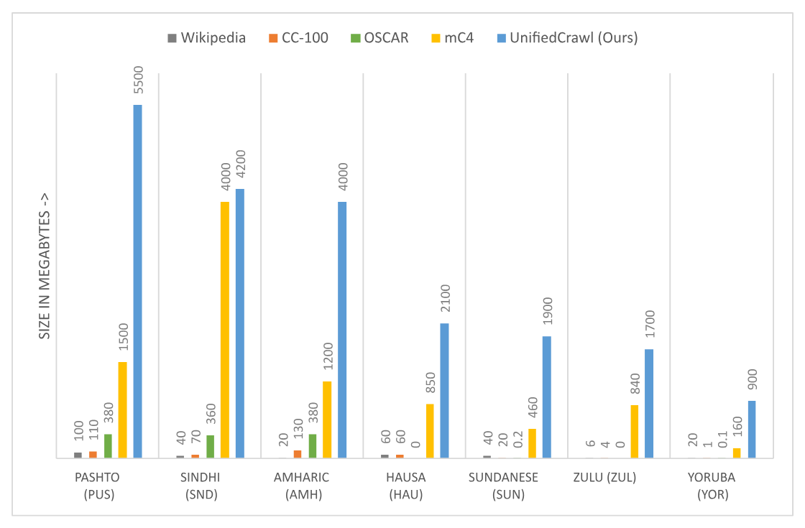

# UnifiedCrawl: Aggregated Common Crawl for Affordable Adaptation of LLMs on Low-Resource Languages

🌟 [ArXiv Preprint](https://arxiv.org/abs/2411.14343)

Make largest monolingual datasets for low-resource languages from all of Common Crawl! Data Collection, Bechmarking, and Fine-tuning.



## 🔗 Quick Links

- [UnifiedCrawl: Aggregated Common Crawl for Affordable Adaptation of LLMs on Low-Resource Languages](#unifiedcrawl-aggregated-common-crawl-for-affordable-adaptation-of-llms-on-low-resource-languages)
  - [🔗 Quick Links](#-quick-links)
  - [Brief Introduction](#brief-introduction)
  - [How to setup an environment](#how-to-setup-an-environment)
    - [Install conda](#install-conda)
    - [Create conda python environment, install cuda](#create-conda-python-environment-install-cuda)
    - [Install python dependencies](#install-python-dependencies)
    - [Setup other dependencies to download CC data](#setup-other-dependencies-to-download-cc-data)
  - [How to download the data from CC](#how-to-download-the-data-from-cc)
    - [Filter the CC index by Language](#filter-the-cc-index-by-language)
  - [Remove duplicate URLs](#remove-duplicate-urls)
    - [Download and extract the text from filtered CC index](#download-and-extract-the-text-from-filtered-cc-index)
  - [Deduplicate Data](#deduplicate-data)
    - [Install Rust](#install-rust)
    - [Build binary for deduplicate-texts-datasets](#build-binary-for-deduplicate-texts-datasets)
    - [Run Data Deduplication](#run-data-deduplication)
      - [Combine crawl files into one for each crawl](#combine-crawl-files-into-one-for-each-crawl)
      - [Deduplicate a single crawl](#deduplicate-a-single-crawl)
      - [Deduplicate all crawls together](#deduplicate-all-crawls-together)
      - [Filter very short documents](#filter-very-short-documents)
  - [How to benchmark original models on amharic/english](#how-to-benchmark-original-models-on-amharicenglish)
  - [How to finetune model on amharic](#how-to-finetune-model-on-amharic)
  - [Bugs or Questions?](#bugs-or-questions)
  - [Citation](#citation)

## Brief Introduction

1. Download mono-lingual datasets from common crawl. See the section [How to download the data from CC](#how-to-download-the-data-from-cc)
1. Deduplicate dataset using exact substring match. See [Deduplicate Data](#deduplicate-data)
1. [Benchmark](#how-to-benchmark-original-models-on-amharicenglish) pre-trained original models, and [finetune](#how-to-finetune-model-on-amharic) using the crawled data

## How to setup an environment

### Install conda

```bash
mkdir -p ~/miniconda3
wget https://repo.anaconda.com/miniconda/Miniconda3-latest-Linux-x86_64.sh -O ~/miniconda3/miniconda.sh
bash ~/miniconda3/miniconda.sh -b -u -p ~/miniconda3
rm -rf ~/miniconda3/miniconda.sh
~/miniconda3/bin/conda init bash
source ~/.bashrc
```

### Create conda python environment, install cuda

```bash
conda create -y --name data_env python==3.10.12
conda activate data_env
conda install -c "nvidia/label/cuda-11.8.0" cuda-toolkit
# install gcc compiler
sudo apt update && sudo apt install -y gcc unzip
```

### Install python dependencies

```bash
pip install -r setup/requirements_data.txt -r setup/requirements.txt
# Alternatively, to exactly mirror our dependency environment, use below -
# pip install --extra-index-url https://download.pytorch.org/whl/cu118 -r setup/requirments_full.txt

```

<!-- pip install torch torchvision torchaudio --index-url https://download.pytorch.org/whl/cu118
pip install transformers datasets tqdm pandas evaluate bitsandbytes accelerate openpyxl sentencepiece scipy peft tensorboard
pip install -r setup/requirments_full.txt -->

### Setup other dependencies to download CC data

```bash
# install duckdb
mkdir ~/opt
cd ~/opt
wget https://github.com/duckdb/duckdb/releases/download/v0.8.1/duckdb_cli-linux-amd64.zip
unzip ./duckdb_cli-linux-amd64.zip
~/opt/duckdb -c "INSTALL httpfs"
```

## How to download the data from CC

### Filter the CC index by Language

Run the following in the terminal-
Set the environment variables `CC_CRAWL_VERSION`, `S3_ACCESS_KEY`, and `S3_SECRET_ACCESS_KEY` before running!

```bash
CC_CRAWL_VERSION="CC-MAIN-2023-06" ./download_data/download_and_filter_warc_index.sh 2>&1 | tee datasets/errors.txt
```

The above command sometimes has some errors, so just re-run the following script many many times -

```bash
CC_CRAWL_VERSION="CC-MAIN-2023-06" ./download_data/download_and_filter_warc_index_retry.sh 2>&1 | tee datasets/errors.txt
CC_CRAWL_VERSION="CC-MAIN-2023-06" ./download_data/download_and_filter_warc_index_retry.sh 2>&1 | tee datasets/errors.txt
```

## Remove duplicate URLs

If your language has many URLs repeatedly crawled, you may benefit for removing duplicate URLs in the warc files across all dumps.

This can be done via simple use of the `pandas` library for example. We skip this code here

### Download and extract the text from filtered CC index

```bash
python ./download_data/download_and_extract_text_from_warc.py --cc-crawl-version=CC-MAIN-2023-06
```

## Deduplicate Data

### Install Rust

```bash
curl --proto '=https' --tlsv1.3 https://sh.rustup.rs -sSf | sh
source $HOME/.cargo/env

# check if rust is installed successfully
rustc --version
```

### Build binary for deduplicate-texts-datasets

Note - Increase/Decrease the variable `jobs_at_once` in the file [make_suffix_array.py](deduplicate_data/deduplicate-text-datasets/scripts/make_suffix_array.py) to increase/decrease the number of parallel jobs based on your CPU cores. Decreasing the number of parallel jobs may also help reducing RAM usage.

```bash
cd ./deduplicate_data/deduplicate-text-datasets
cargo build
```

### Run Data Deduplication

#### Combine crawl files into one for each crawl

First, combine the files in a single crawl into one file. The following command will do it for all crawls.

```bash
python deduplicate_data/combine_single_dump.py
```

#### Deduplicate a single crawl

```bash
cd deduplicate_data/text-dedup

# remove any previous deduplicated files
rm -rf ./output && rm -rf ../deduplicate-text-datasets/.cache/ ../deduplicate-text-datasets/output/ ../deduplicate-text-datasets/tmp

# "(When running on larger files, if you get an error that you have too many open files, that's because this script opens lots of files. You should run ulimit -Sn 1000000 to "fix" the error. You might want to do this preemptively before hitting this crash after hour ten of the job.)"
ulimit -Sn 1000000

# To de-duplicate a single-crawl
CC_CRAWL="CC-MAIN-2023-06"
LANGUAGE="amh"
python -m text_dedup.suffix_array \
    --path "json" \
    --data_files "../../datasets/$CC_CRAWL/amh_txt_collections_hf_combined.jsonl" \
    --output "../../datasets/$CC_CRAWL/${LANGUAGE}_dedup" \
    --split 'train' \
    --column 'text' \
    --google_repo_path "../deduplicate-text-datasets" \
    --local \
    --batch_size 10000 \
    --k 50
```

We can use a simple bash for loop to run the above for all the crawls using -

```bash
LANGUAGE="amh"
for i in ../../datasets/CC-MAIN* ; do
    echo $i
    CC_CRAWL=`basename $i`
    echo $CC_CRAWL
    rm -rf ./output && rm -rf ../deduplicate-text-datasets/.cache/ ../deduplicate-text-datasets/output/ ../deduplicate-text-datasets/tmp
    python -m text_dedup.suffix_array \
        --path "json" \
        --data_files "../../datasets/$CC_CRAWL/${LANGUAGE}_txt_collections_hf_combined.jsonl" \
        --output "../../datasets/$CC_CRAWL/amh_dedup" \
        --split 'train'\
        --column 'text' \
        --google_repo_path "../deduplicate-text-datasets" \
        --local \
        --batch_size 10000 \
        --k 50 ;
    done
```

#### Deduplicate all crawls together

We deduplicated all the crawls separately first, because the original code requires much more time/memory if there are a very large number of duplicates. (see issue discussion [here](https://github.com/google-research/deduplicate-text-datasets/issues/18)).

We can run the command below to deduplicate across crawls our already-deduplicated single crawls -

```bash
rm -rf ./output && rm -rf ../deduplicate-text-datasets/.cache/ ../deduplicate-text-datasets/output/ ../deduplicate-text-datasets/tmp
python -m text_dedup.suffix_array \
    --path "arrow" \
    --data_files "../../datasets/*/${LANGUAGE}_dedup/*.arrow" \
    --output "../../datasets/${LANGUAGE}_dedup" \
    --split 'train' \
    --column 'text' \
    --google_repo_path "../deduplicate-text-datasets" \
    --local \
    --batch_size 10000 \
    --k 50
```

#### Filter very short documents

After deduplication some documents become very short in length, hence, we remove those documents of length less than 100 characters. Change the `LANGUAGE` variable at the top of the file.

```bash
python deduplicate_data/remove_short_docs.py
```

## How to benchmark original models on amharic/english

While we present instructions for Amharic language, similar methods can be used for any language.

1. Change the values in the file [evaluate_model/hyperparameters.py](evaluate_model/hyperparameters.py)
1. Run the model using `python evaluate_model/run_model.py`

## How to finetune model on amharic

While we present instructions for Amharic language, similar method can be used for any language.

Run the script below to finetune. Change the necessary variables.

```bash
# rm -rf ./finetune_model/output_dir/facebook/xglm-4.5B/
./finetune_model/run_finetune.sh
```

## Bugs or Questions?

If you have any questions related to the code or the paper, feel free to email Bethel Melesse at the email provided in the manuscript. If you encounter any problems when using the code, you can open an issue!

## Citation

Please cite our paper if you find the repo helpful in your work:

```bibtex
@article{tessema2024unifiedcrawl,
  author       = {Bethel Melesse Tessema and
                  Akhil Kedia and
                  Tae-Sun Chung},
  title        = {UnifiedCrawl: Aggregated Common Crawl for Affordable Adaptation of LLMs on Low-Resource Languages},
  journal      = {CoRR},
  volume       = {abs/2411.14343},
  year         = {2024},
  url          = {https://doi.org/10.48550/arXiv.2411.14343},
  doi          = {10.48550/ARXIV.2411.14343},
  eprinttype    = {arXiv},
  eprint       = {2411.14343}
}
```
